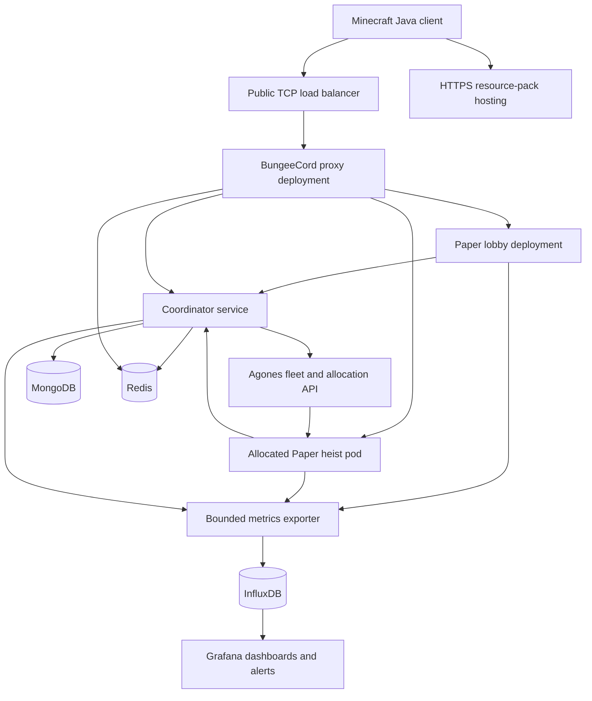

# GameHeist — Game Design & Engineering Plan

Version 1.0 · 12 September 2026 · Planning document; no implementation or performance claims.

## 1. Project purpose

Build an original, cooperative Minecraft Java heist minigame inspired by PAYDAY 2's planning, stealth-to-loud escalation, objective defense, and extraction. The portfolio should demonstrate that you can deliver a fun game, explain its architecture, measure its performance, and operate it reliably.

**Pitch:** Four players infiltrate a fortified bank, disable its security, crack the vault, and escape with as much loot as they dare. A clean operation becomes a frantic defense when the alarm sounds. The crew decides whether another bag is worth the risk.

Use original names, maps, models, audio, and UI. Inspiration is the cooperative structure; do not import PAYDAY assets or present this as an official Hypixel project.

The strongest submission is one polished, complete heist supported by observable infrastructure. Additional maps and infrastructure sophistication come after a satisfying playable loop.

## 2. Scope and assumptions

| Area | Portfolio release | Later expansion |
|---|---|---|
| Players | 1–4 in private sessions; public queue targets 4 | Wider matchmaking and party features |
| Content | One bank, two entry routes, two difficulties | Museum, train, laboratory; procedural variations |
| Approaches | Stealth with irreversible loud escalation | More routes and optional objectives |
| Loadouts | Four sidegrade roles; three saved presets | Larger skill trees and cosmetic collection |
| NPCs | Guards, responders, heavy responders | Specialists and richer civilian behavior |
| Platform | One pinned modern Java client/server version | Deliberate compatibility project if needed |
| Hosting | Kubernetes, one Paper process per match | Multiple regions after measured demand |
| Networking | BungeeCord proxy and lobby in Kubernetes | Optional Velocity adapter |
| Persistence | MongoDB; Redis for coordination/cache | Dedicated analytics pipeline if justified |
| Operations | InfluxDB, Grafana, arena tools, runbooks | Advanced live operations |

This plan retains literal BungeeCord support as requested. Velocity is an alternative architecture decision, not a silent replacement. Targeting old Minecraft versions would substantially change rendering, proxy forwarding, and API choices; it is outside this release.

## 3. Player experience

### Core loop

Join network → load required pack → choose preset → form crew/queue → receive briefing → infiltrate → access vault → secure loot → extract → see results and progression → return to lobby.

Target match duration: **12–18 minutes**, with a 20-minute hard limit. These and all gameplay numbers below are initial tuning hypotheses.

### First map: Brasslock Bank

The map contains a public hall, staff corridor, security room, vault approach, side alley, roof access, and extraction yard. A compact layout keeps teammates within helping distance. Cover and loops provide alternatives to narrow chokepoints.

1. **Briefing, 30 seconds:** Show required bags, entry choices, equipment, and extraction location. Explain three controls through a short practice area in the lobby.
2. **Infiltration, roughly 2–4 minutes:** Use the staff entrance or roof. Locate a keycard and disable cameras at the security terminal. Patrols create readable windows of opportunity.
3. **Vault access, roughly 3–5 minutes:** Install a drill; defend or conceal it. Complete one short support objective to restore power or stabilize the mechanism.
4. **Loot, roughly 2–3 minutes:** Collect at least three bags. Optional bags increase the shared reward and time spent exposed.
5. **Extraction, roughly 2–4 minutes:** Activate the escape route and survive its countdown. Banked loot counts only when the crew successfully extracts.
6. **Results:** Show outcome, secured bags, stealth/loud route, team contributions, and saved or pending rewards.

### Win, loss, and reconnect rules

- Win when the minimum loot is secured and at least one active player completes extraction. An early-extraction interaction requires a majority of active crew members; tied votes do not pass. Final countdown warns players left outside.
- Lose if all players are incapacitated with nobody able to revive, nobody returns within the all-disconnected grace period, or the match timer expires.
- Downed players have a provisional 30-second bleedout. Reviving takes six uninterrupted seconds. After bleedout, spectate until one limited rescue opportunity is completed. Team wipe is immediate if rescue is no longer possible.
- Reserve a disconnected player's slot for 90 seconds. Their avatar remains vulnerable for ten seconds, then despawns; carried loot drops once. Rejoining restores the authoritative state, never a fresh inventory or health reset.
- Do not backfill after infiltration starts. Existing crews may continue short-handed; apply only bounded adjustments to future reinforcement waves.
- Infrastructure-aborted matches do not record a gameplay loss. No partial reward is promised unless a durable result already exists. Lobby messaging explains the interruption.

### Stealth and escalation

Each guard has a suspicion meter. Visibility depends on distance, facing, unobstructed line of sight, and player action. Sprinting, drilling, and combat generate local noise events. Suspicion decays when evidence disappears; reaching the threshold triggers investigation, then a telegraphed alarm attempt.

Camera exposure and a guard completing an alarm interaction can activate the global alarm. Once loud, the match cannot return to stealth. Players keep objective progress, so detection changes the experience rather than wasting the run. Include visual and text cues alongside sounds; never rely solely on red/green color differences.

Stealth success earns a modest completion bonus. Loud play remains viable and comparably rewarding per minute, so players do not abandon the match after detection.

### Combat and cooperation

Use stylized Minecraft equipment and clear reload/cooldown feedback. Start with three weapon behaviors: accurate single shot, short-range spread, and slower heavy shot. The server validates fire rate, ammunition, range, obstruction, and damage. No friendly fire for the portfolio release.

Carrying a bag occupies one equipment slot and reduces movement modestly. Teammates can revive, repair, mark threats, and transport loot. Every objective is possible with any role; roles create useful shortcuts without mandatory composition.

| Role | Benefit | Tradeoff |
|---|---|---|
| Technician | Faster repairs; limited camera disruption | Lower combat sustain |
| Scout | Longer threat marks; reduced detection buildup | Lighter armor |
| Enforcer | Better protection and crowd control | Lower mobility |
| Support | Extra healing and faster revives | Lower burst damage |

Start with a 90-second drill, six-second repairs, and at most two seeded jams per vault attempt. Signal jams in advance where possible. A seeded rule makes balancing and reproduction easier than uncontrolled random stalls.

Normal and Hard should differ through patrol coverage, reinforcement timing, and objective pressure, not just health multipliers. Scale solo health pressure and required bags separately from four-player tuning; record the participant count in results.

## 4. Progression, settings, and statistics

### Loadouts and preferences

Store three named presets with role, primary equipment, gadget, and cosmetic references. Save preferred preset, language, sound preferences, reduced particles, reduced motion, and notification options. Do not claim to configure arbitrary client controls from a server plugin.

The lobby validates unlocks, slot rules, and known item IDs before saving. Edits use a profile revision to reject stale overwrites. Match admission captures an immutable, validated loadout snapshot; editing a lobby preset never changes an active run.

Progression initially unlocks cosmetics and sidegrades. Avoid a grind requirement before players can experience the interesting mechanics. Disable purchases and progression writes in admin practice sessions.

### Statistics

Persist completed runs, wins, gameplay losses, aborted runs, secured bags, revives, objective interactions, stealth completions, damage, playtime, and best completion times. Partition records by map version, difficulty, and party-size category so unlike runs are not directly ranked together.

The result screen emphasizes crew success and useful contributions. Personal kill counts must not outweigh objective work. Exclude debug sessions and invalidated results from leaderboards.

Maintain a durable immutable match result and derived per-player totals. Leaderboards may be eventually consistent and cached in Redis. Profile and reward correctness must not depend on the cache. Establish configurable retention for detailed history and operational logs; avoid collecting chat or IP addresses as gameplay telemetry.

## 5. System architecture

### Responsibilities

- **Game plugin:** Owns authoritative match state, objectives, entities, combat, pack gating, and result construction. One process owns one match.
- **Lobby plugin:** Menus, tutorial, party interactions, loadout editing, queue UI, and results display.
- **Proxy plugin:** Authenticated player identity, dynamic backend registration, admission-aware transfers, and lobby fallback.
- **Coordinator:** Profile API, durable reservations, allocation reconciliation, admission grants, result persistence, and reward processing. Begin as one service with internal modules, not many small services.
- **MongoDB:** Durable profiles, sessions, matches, rewards, content metadata, and audit history.
- **Redis:** Expiring presence, queue hints, cached leaderboards, and invalidation notifications. Authoritative reservation state remains durable.
- **Agones:** Kubernetes game-server lifecycle and allocation. The coordinator still owns application-specific matchmaking and recovery.

Suggested repository modules: `heist-domain`, `heist-paper`, `heist-lobby`, `heist-proxy-bungee`, `heist-coordinator`, `heist-contracts`, plus `content/`, `resource-pack/`, `deploy/`, and `docs/`. Add modules when their responsibility becomes real.

Keep the domain model independent of Bukkit: match state, objective rules, rewards, and loadout validation should be testable with a fake clock and seeded random source. Prefer ordinary composition and explicit dependencies over a custom plugin framework.

## 6. Kubernetes and network lifecycle

### Match provisioning

1. Crew queues only after profiles and the required pack are ready. The coordinator creates an idempotent reservation with a unique active-session constraint per player.
2. Allocate a Ready server from an Agones fleet. Attach reservation identity during allocation; reconcile uncertain responses by that identity rather than blindly allocating again.
3. Each pod starts from an immutable server image and copies a versioned arena template into its own writable ephemeral world directory. Never mount one writable arena into multiple matches.
4. Readiness requires successful plugin initialization, matching content/pack manifest, and loaded arena chunks. Maintain a small warm pool to hide startup latency.
5. Persist the allocated server identity and expected crew. The proxy registers its unique backend address and confirms registration before transfer.
6. Create short-lived admission grants bound to player UUID, match, server identity, and reservation generation. Transfer through the trusted proxy; never accept arbitrary client-provided backend addresses or identities.
7. The backend verifies and consumes admission atomically. Duplicate joins, stale grants, and wrong-server transfers fail safely. Partially transferred crews wait in briefing; retries use the same reservation until expiry.
8. Run the match without remote service calls in the tick loop. After completion, submit the immutable result and wait for durable acknowledgement.
9. Return players to a healthy lobby, unregister the backend, and shut down the game server. The fleet replenishes capacity with a fresh world.

Agones offers atomic server allocation and preserves allocated servers during normal fleet updates until shutdown. This does not make a match immune to node failure or forced deletion. See [allocation semantics](https://agones.dev/site/docs/reference/gameserverallocation/) and [fleet updates](https://agones.dev/site/docs/guides/fleet-updates/).

### Routing and security

Expose only the proxy's Minecraft TCP port publicly. A normal HTTP ingress is not a Minecraft TCP router. The proxy must address the exact allocated backend; never balance a single match across arbitrary game pods.

Keep proxy and backend traffic private, restrict it with a NetworkPolicy-capable CNI and applicable firewalls, and configure BungeeCord identity forwarding correctly on both ends. Forwarding alone does not authenticate a network path. If adopting Velocity instead, use modern forwarding plus network isolation. See [BungeeCord forwarding](https://www.spigotmc.org/wiki/bungeecord-ip-forwarding/) and [Velocity security](https://docs.papermc.io/velocity/security/).

Scale proxy/lobby deployments independently from the heist fleet. Existing TCP sessions stay attached to their proxy; proxy failure requires reconnecting and does not transparently migrate connections. New connections can land on another proxy, which restores routing from authoritative session state.

Use minimal service-account permissions: only the coordinator needs allocation permissions; ordinary game pods do not need broad Kubernetes API access. Use scoped service credentials, secret injection, non-root containers, pinned images, and restricted administration endpoints.

### Draining and health

Stop new allocations to an old fleet and let active matches finish before planned removal. Distinguish deployment draining from handling an already-delivered SIGTERM. On termination, stop admission, save a terminal result if possible, transfer players, and exit within a measured grace period. Do not expect a short termination grace period to preserve an entire match.

Use startup probes for world loading, readiness for admission eligibility, and liveness for genuine process/tick failure. An unavailable MongoDB must not trigger a restart storm across otherwise healthy matches. Kubernetes may forcibly terminate after the grace period: [pod lifecycle](https://kubernetes.io/docs/concepts/workloads/pods/pod-lifecycle/).

The release supports match abort and lobby recovery after pod failure, not live restoration of every NPC and projectile. Checkpoint/replay recovery is a separate project.

## 7. Persistence and messaging correctness

| Collection | Key data and constraints |
|---|---|
| `players` | UUID key, schema version, profile revision, presets, unlocks, aggregate statistics |
| `active_sessions` | Unique player UUID; reservation, match, generation, expiry, status |
| `matches` | Unique match ID; state, server generation, participants, versions, seed, immutable result |
| `reward_receipts` | Unique `(matchId, playerId, rewardVersion)`; applied reward and timestamp |
| `arena_versions` | Arena ID/version, manifest hash, pack version, object-storage path, publication status |
| `admin_audit` | Actor UUID, action, target, request ID, outcome, timestamp |

Index actual query patterns: recent matches per player, active reservations by state/expiry, and arena ID/version. Bound document sizes; do not embed an ever-growing match history inside a player profile. Treat expiry timestamps explicitly when authorizing actions rather than assuming background TTL deletion happens immediately.

### Reward flow

The coordinator accepts a terminal result only from the server generation assigned to that match. Repeating the same result returns the original acknowledgement; a conflicting payload is rejected and logged.

Persist the terminal result before reporting that rewards are secured. A worker finds participants without reward receipts. In a MongoDB transaction it inserts the unique receipt and applies the corresponding profile/stat changes. Commit both or neither; retry transient errors and resolve ambiguous outcomes by checking the receipt. A crash after commit but before acknowledgement cannot award twice.

Use a replica set in development for transaction behavior, even if it is a single-node development deployment. A single-node replica set is not high availability. Production-like topology and backups are a separate deployment concern. MongoDB documents [replica-set transactions](https://www.mongodb.com/docs/manual/replication/) and [unique indexes](https://www.mongodb.com/docs/manual/core/index-unique/).

This is at-least-once submission with idempotent application, not a claim of universal exactly-once delivery. Unacknowledged data still only in a dying game pod can be lost. Stop admitting matches during durable-storage outages; retry finalization within a bounded period and explicitly mark unresolved runs for operator investigation.

### Redis use

Use Pub/Sub for disposable invalidation hints, backed by cache TTLs and periodic reconciliation. Never award currency from a Pub/Sub message. Redis documents that Pub/Sub messages can be permanently lost; Streams can support acknowledged processing when needed: [Redis delivery semantics](https://redis.io/docs/latest/develop/interact/pubsub/).

For the initial release, a MongoDB-backed pending-work scan is sufficient for reward recovery. Add Streams only when a measured need warrants consumer groups, retries, pending-entry recovery, and poison-message handling. Do not use a consumer group as if every proxy receives every broadcast.

## 8. NPC AI

Implement a finite-state machine first: `PATROL → SUSPICIOUS → INVESTIGATE → ALERT → COMBAT → SEARCH`, with explicit incapacitated/despawned terminal states. A guard remembers last known position rather than seeing through walls.

- **Perception:** Spatially filter nearby candidates, check field of view, then perform line-of-sight checks. Stagger checks across ticks, initially at 5 Hz per guard.
- **Navigation:** Author patrol points, doors, cover anchors, and reinforcement entrances. Prefer the pinned platform's navigation facilities; isolate any NMS use behind a narrow adapter.
- **Combat:** Telegraph attacks, respect cover, throttle retargeting, and use a bounded active NPC count—initially 24 for four players.
- **Director:** Choose reinforcement intensity from phase, time, active crew, and recent pressure. Use cooldowns and hard caps so adjustment feels fair and remains predictable.
- **Stuck handling:** Detect lack of movement, retry a route, choose another anchor, then safely retire/reposition outside player sight. Log repeated failures.
- **Debugging:** Staff overlays show state, target, suspicion, path, and per-update cost. An arena seed and event trace support reproducing logic; they do not guarantee deterministic Minecraft physics replay.

No database requests, unbounded entity scans, or path searches per NPC per tick. Access Bukkit worlds/entities on their owning server thread. Async workers may operate only on copied immutable inputs; apply results back on the server thread after checking that the match and entity still exist.

## 9. Resource pack and visual direction

Create low-resolution, block-shaped props with readable silhouettes: a drill with idle/running/jammed states, swiveling camera, terminal, loot bag, alarm beacon, and escape marker. Use restrained mechanical detail and original sounds. Provide source models, exported assets, and attribution/license records.

Use the pinned version's item-model system and display/interaction entities where appropriate. Appearance and hit detection are separate: the server validates distance, line of sight, objective state, and interaction cooldown. A visually convincing camera is not its own security logic.

Pack pipeline: source models/textures → validate asset references and metadata → deterministic archive → content hash → HTTPS object storage → versioned release manifest. Retain older packs while older matches finish. Include required pack ID/version in arena and game releases.

Mark the pack required. Gate gameplay on `SUCCESSFULLY_LOADED`, not just acceptance or download initiation. Handle decline, failed download, invalid URL, failed reload, and timeout with clear retry/reconnect instructions; never admit an unready player. A clean unmodified client should need no extra mod. The API distinguishes successful application from failure states: [Paper resource-pack statuses](https://jd.papermc.io/paper/26.1.2/org/bukkit/event/player/PlayerResourcePackStatusEvent.Status.html).

Test a fresh client cache, cached pack, slow download, declined pack, broken URL, and a lobby-to-match transfer. Initial compressed-pack budget: 10 MB. Client pack-status reports are an experience gate, not proof that a modified client is trustworthy.

## 10. Arena and administrative tooling

Provide permission-scoped commands and an in-game editor before building a web panel.

| Tool | Capability |
|---|---|
| `/heist arena create/edit` | Work on a draft in a dedicated build environment |
| `/heist arena set ...` | Define bounds, crew spawn, loot, vault, drill, camera, extraction, patrol and cover anchors |
| `/heist arena validate` | Report missing nodes, invalid references, unsafe spawns, disconnected objective graph, absent assets |
| `/heist arena preview` | Run an isolated non-rewarding test with overlays |
| `/heist arena publish` | Freeze a validated version and record author/hash |
| `/heist match inspect` | Inspect phase, participants, versions, and health |
| `/heist match stop` | Controlled abort with reason and audit entry |
| `/heist fleet drain` | Stop admission to a release while matches finish |
| `/heist debug ai` | Visualize NPC decisions for permitted staff |

Deny management capabilities by default. Separate edit, publish, abort, drain, and debug permissions. Revalidate authorization in the coordinator, not just the command UI. Audit production mutations and confirm destructive actions with a short-lived action-specific token.

Arena manifests include a schema version, bounds, objective graph, placement IDs, AI routes, difficulty tuning, world archive hash, and required pack version. Validate objective reachability structurally and playtest actual navigability. Publishing affects new sessions; active sessions keep their immutable version. Rollback selects a previous manifest without modifying a running world.

## 11. Metrics and operational visibility

Send metrics asynchronously in bounded batches to InfluxDB. Exporter failure must never block gameplay: use capped memory, backoff, and a dropped-samples counter. Keep structured logs separate from the metrics store; include match/request IDs in logs for correlation.

Select and pin the InfluxDB edition, version, client, retention behavior, and Grafana query language together. Suggested new-deployment baseline: InfluxDB 3 with SQL after a retention/query compatibility spike. Do not copy Flux dashboards into that setup. Grafana supports multiple InfluxDB versions and query languages: [data-source configuration](https://grafana.com/docs/grafana/latest/datasources/influxdb/configure/).

| Dashboard | Measurements | Initial alert condition |
|---|---|---|
| Game health | Tick duration distribution, TPS, heap, GC pauses, entities, AI duration | p95 tick duration above 45 ms for 5 minutes |
| Admission | Queue age, ready capacity, allocation/transfer latency, failures, pack failures | No ready capacity with waiting players for 60 seconds |
| Persistence | Request latency/errors, result backlog age, duplicate submissions | Oldest pending result above 60 seconds |
| Gameplay | Completion rate, phase duration, alarm cause, bags, revives | Inspect trends; avoid paging on small samples |
| Infrastructure | Pod restarts, CPU throttling, memory pressure, storage, collector health | Repeated crash/OOM or missing telemetry |

Use bounded dimensions such as environment, region, map, difficulty, phase, and release. Do not tag every sample with player UUID or match ID. Collect histogram buckets or raw bounded samples where appropriate; never average per-server p95 values to invent a fleet p95. Define dashboard queries and alerts in version control.

All thresholds are proposed test targets, not demonstrated service guarantees. Measure warm allocation separately from world boot and pack download. An external uptime check should detect loss of the monitoring stack itself.

## 12. Technical requirements and performance budgets

| Component | Proposed baseline |
|---|---|
| Language/build | Java, Gradle wrapper, pinned dependency versions, Java toolchain |
| Game runtime | One pinned stable Paper 26.1+ release and matching client; Java 25 |
| Proxy | Pinned BungeeCord build verified against that client/backend pair |
| Infrastructure | Linux containers, Kubernetes and compatible pinned Agones release |
| Data | MongoDB replica set, Redis, InfluxDB, Grafana, HTTPS asset storage |
| Testing | JUnit domain tests, container-backed data integration tests, real-client playtests |
| Delivery | CI build, asset validation, image publishing, staging deploy, smoke test, promoted release |

Paper's published version matrix uses Java 25 for 26.1+ and Java 21 for 1.20–1.21.11; pin the actual selected server build rather than floating to latest: [Paper requirements](https://docs.papermc.io/paper/getting-started/).

Initial sizing hypothesis per match: request 1 vCPU and 2 GiB RAM; memory limit 3 GiB with heap around 1.5–2 GiB, leaving native/non-heap headroom. Benchmark CPU throttling before selecting a CPU limit. Two match pods plus lobby, data services, and Kubernetes will require substantially more than 6 GiB total; start local cluster planning around 16–24 GiB available RAM and adjust from measurements. These are estimates, not capacity guarantees.

Acceptance targets on recorded hardware:

- Four real players and 24 active NPCs at p95 tick duration below 45 ms during loud combat.
- Custom AI contribution p95 below 3 ms per tick in that scenario.
- Warm reservation-to-backend-ready p95 below 5 seconds, excluding pack download; measure cold boot separately.
- Fifty consecutive complete matches with no accumulating tasks/entities/world state and no duplicated reward effects.
- Repeating an accepted result 100 times changes each participant's totals once.
- A fresh cluster can reproduce the documented demo using pinned artifacts and configuration.

Report sample count, duration, hardware, versions, player/bot behavior, and outliers. Synthetic load cannot substitute for testing actual rendering, menus, and combat feel.

## 13. Implementation roadmap

Indicative solo effort: **12–18 focused weeks**, with map/art availability and Kubernetes experience as major variables. Use the exit criteria to control progress rather than treating dates as commitments.

| Step | Work | Exit criterion |
|---|---|---|
| 1 — Decisions and spikes | Pin client/Java/Paper/Bungee versions; test one model, pack enforcement, proxy transfer; record architecture decisions | Fresh vanilla client joins through proxy, loads pack, interacts with a prop |
| 2 — Domain foundation | State machine, fake clock, objective graph, loadout rules, deterministic reward calculation, CI | Illegal transitions and duplicate completion are covered by meaningful tests |
| 3 — Playable graybox | One local arena, crew spawn, drill, loot, extraction, failure, clean session shutdown | Four players finish a complete run without admin intervention |
| 4 — AI and tension | Guard states, suspicion, camera alarms, loud director, revives, two roles first | Players understand detection and can recover from a loud transition |
| 5 — Content and UX | Finish four roles, map routes, tutorial, models, sound cues, menus, difficulty | Fresh testers complete a run with minimal verbal instruction |
| 6 — Persistence | Profile API, presets, immutable results, transactional receipts, statistics | Restart preserves data; repeated results do not duplicate rewards |
| 7 — Network sessions | Lobby, parties, reservation generation, admission, reconnect, dynamic backend registry | Two simultaneous crews stay isolated through transfer and reconnect |
| 8 — Kubernetes | Images, arena bootstrap, Agones fleet, warm pool, policies, probes, drain | Allocate two instances, finish matches, observe clean disposal and replacement |
| 9 — Observability | Influx exporter, provisioned Grafana panels/alerts, correlated logs | A triggered fault appears in the correct dashboard and leads to a runbook |
| 10 — Admin workflow | Editor, validation, immutable publish, permissions, audit, rollback | A new arena version is published without a code change or active-match mutation |
| 11 — Reliability and performance | Outage drills, duplicate/reordered requests, profiling, soak tests, abuse cases | Required scenarios below pass with recorded evidence and known limitations |
| 12 — Portfolio release | Tagged build, demo video, screenshots, architecture guide, benchmark report | Reviewer can assess the game and engineering without compiling anything |

Develop locally with lightweight services first; introduce Kubernetes after the local heist works. Add basic metrics/logging early, then finish dashboards in step 9. Playtest every week and record one observed issue, design change, and follow-up result.

## 14. Development practices and verification

- Keep handlers thin; route validated actions into domain rules. Separate game state from visual effects so presentation cannot accidentally grant rewards.
- Make states explicit: `BOOTING → READY → RESERVED → BRIEFING → INFILTRATION → VAULT → EXTRACTION → FINALIZING → RETURNING → CLOSED`, with terminal abort paths. Alarm level is a separate state, not a second tangled lifecycle.
- Centralize scheduled work under a match lifetime. On completion, cancel tasks, close subscriptions, remove entities, and reject late async callbacks using match generation checks.
- Put I/O on bounded executors with deadlines. Return to the correct server thread before touching world/player objects.
- Version network contracts and content. Include request identity, schema version, and expected generation; tolerate additive fields across rolling releases.
- Validate every inventory click, equipment use, loot interaction, and administrative request server-side. Prevent double pickup with an atomic match-thread state transition.
- Write small reviewable commits and short design decisions explaining alternatives. Avoid reflection frameworks, broad NMS dependencies, or extra services without a concrete need.
- Store secrets outside Git. Keep backups and rehearse restoring MongoDB; a replica set alone is not a backup.

Required scenario matrix:

| Scenario | Expected result |
|---|---|
| Same crew queues twice / two coordinators race | One effective active reservation per player |
| Allocation succeeds but response is lost | Reconciliation finds the original allocation; no orphan match |
| Proxy registration or transfer fails halfway | Same reservation can retry or expire; players recover to lobby |
| Wrong UUID, stale admission, or obsolete server submits result | Request rejected and logged |
| Player disconnects carrying loot | One bag exists; reconnect cannot duplicate it |
| MongoDB unavailable during finalization | Bounded retries; no false saved-success message; unresolved state visible |
| Redis unavailable | Running matches continue; cache bypass/reconciliation works; queue pauses if required |
| InfluxDB unavailable | Gameplay remains responsive; telemetry drops are counted |
| Pod killed mid-match | Match marked aborted after lease reconciliation; players can rejoin lobby |
| Reward commit acknowledged ambiguously | Receipt lookup/retry yields one reward effect |
| Release deployed mid-match | Existing match retains its content; new matches use the new release |
| Invalid arena or missing model | Validation blocks publication/admission |
| Pack declined or fails to apply | Player never reaches gameplay without a successfully loaded required pack |
| Player spams interactions or malformed menu clicks | Rate limits/state validation prevent extra effects |

Use unit tests for rules and state transitions, integration tests for real database/index behavior, and staging tests for Kubernetes/network failure. Keep screenshots/video and real-client playtests for presentation behavior that mocks cannot verify.

## 15. Hypixel application and interview preparation

Hypixel's current Java Minigame Developer listing emphasizes Java, minigame work, CraftBukkit/Spigot, NMS/packets, teamwork, and creative ideas. Its application guidance says initial reviewers will not compile or run code samples. Put the playable outcome first in a short video and README. This plan is portfolio advice, not knowledge of Hypixel's internal infrastructure or interview rubric. [Official jobs and application guidance](https://hypixel.net/jobs)

### Evidence to prepare

1. **90–120 second video:** Show joining, pack visuals, stealth detection, loud defense, loot/extraction, and the results screen. Finish with a brief deployment/dashboard view.
2. **Readable repository front page:** Pitch, screenshots, architecture thumbnail, your contributions, build/demo instructions, and current limitations.
3. **Three implementation deep dives:** NPC perception and profiling; admission/reconnect correctness; idempotent rewards under uncertain acknowledgements.
4. **One performance report:** Reproducible scenario, profiler capture, bottleneck, change, before/after measurements, and remaining limits.
5. **One incident write-up:** Reproduce a failure, explain user impact, show detection, fix/recovery, and regression coverage.
6. **Collaboration evidence:** Design review, issue discussion, playtest feedback, and clear acknowledgements of contributed art/code.
7. **Small version-specific internals example:** If needed, demonstrate a justified NMS/packet feature behind an adapter and explain threading, cleanup, version dependence, and API alternatives. Do not add internals only to make the code look advanced.

### Questions to rehearse

- Why one match per process, and when would memory cost justify multiple arenas per process?
- Why MongoDB here, and which operations require transactions versus single-document atomicity?
- What happens if the database commits but the response never reaches the game server?
- How do you prevent duplicate allocation and stale-server writes after a timeout?
- What belongs on the Minecraft server thread, and how do you reject stale asynchronous results?
- How do you make guard AI challenging without unfair wall vision or expensive tick work?
- What happens to a player's connection when a proxy or Kubernetes node dies?
- How do you release new assets without breaking matches using the old pack?
- Which numbers were measured, and which are estimates? How would you test ten times the concurrency?
- Which feature did playtesting persuade you to change, and what evidence showed improvement?

Bring honest tradeoffs: modern-version scope, no transparent live-match failover, infrastructure overhead, eventual leaderboard consistency, and the loss window before a result becomes durable. Explain what you deliberately deferred and what evidence would justify building it.

## 16. Release definition

The portfolio release is complete when a reviewer can watch a polished heist, inspect concise code samples, and see verified evidence that two independent Kubernetes matches route correctly, save progress without duplicate effects, expose useful metrics, enforce the pack, and recover visibly from documented failures.

Before adding a second map, finish the full first-map path—including first join, understandable objectives, match loss, disconnect recovery, result persistence, arena publication, and a clear demo. That complete experience is the central portfolio artifact.
