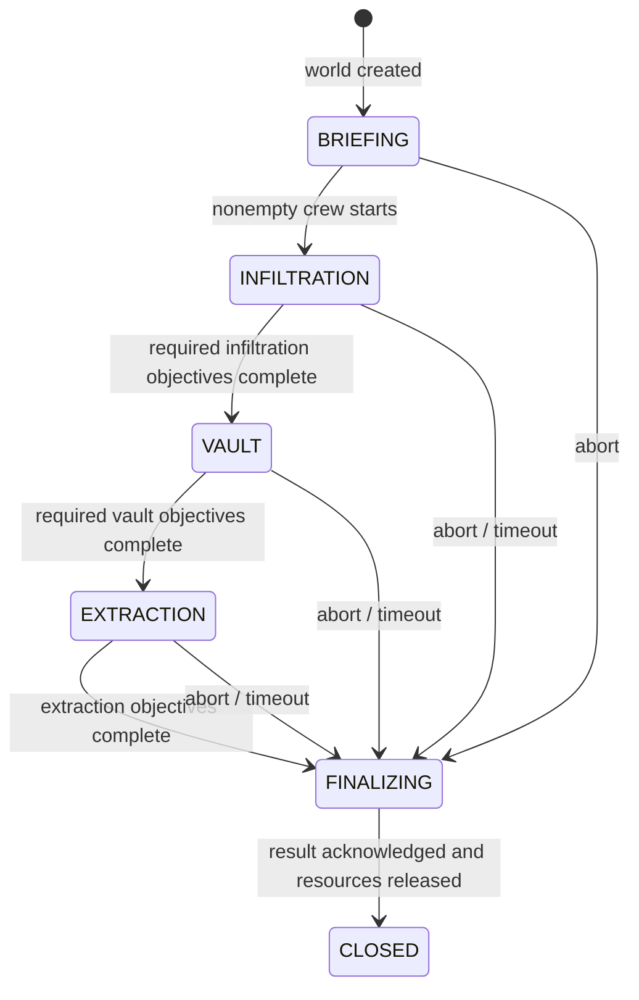

# Foundation architecture

## Ownership

`HeistPlugin` is the composition root. It creates an `ArenaRegistry`, `InstanceManager`, `PaperWorldGateway`, `PlayerSessions`, `ResourcePackGate`, and practice result repository. There is no global singleton service locator.

`InstanceManager` is confined to its construction thread and rejects off-thread access. The Paper scheduler calls it on the server thread. Each entry owns one `Match`, one `WorldInstance`, one `ResourceScope`, and result-finalization state. Player membership is indexed independently to reject concurrent participation.

`ArenaDefinition` is immutable and may be shared. Objectives are definitions; completion sets belong to individual matches. Arena version overwrite is rejected. The match roster contains immutable loadout snapshots.

## State and lifecycle

Alarm state is separate and irreversible during gameplay. A terminal result cannot be replaced by a late abort. Duplicate completion of an already completed objective has no effect. Unknown, premature, and dependency-blocked objectives are rejected. Deadline checks occur before new gameplay actions.

For physical arenas, `ArenaDefinition.heist` contains a validated four-objective recipe and immutable block placements. `Match` owns one `HeistRun`, which tracks seeded drill jams, repair ownership/deadlines, unique bag ownership, secured count, and extraction votes. An older arena can omit the recipe and keep the original admin testing workflow.

`HeistGameplay` samples server-authoritative positions on the owner thread, advances physical logic before instance finalization, and renders labels/HUD. The interaction adapter checks the world, crew, main hand, ray-traced block, range, and phase. `InstanceManager.completeObjective` rejects manual completion for physical arenas. Player movement speed is restored from the session snapshot after carrying loot.

The physical recipe deliberately supports one linear security → drill → loot → extraction path. It validates objective types/dependencies, non-overlapping placements, bounds, timers, and achievable loot counts. Branching contracts and more heist types require a separate recipe rather than silently accepting unsupported configuration.

Presentation cleanup is owned by the instance resource scope. A CLOSING instance must not create a replacement presentation while world-file deletion retries. Secured loot is recorded in the immutable terminal result, but practice runs still have no reward application.

Runtime state distinguishes READY, RUNNING, FINALIZING, and CLOSING. CLOSING means a result was acknowledged but cleanup is not complete. Capacity and crew membership remain occupied while cleanup fails.

## Finalization

1. Match creates one immutable result.
2. `ResultRepository.save` returns a completion stage immediately.
3. The owner-thread tick polls completion; worker callbacks never touch the match.
4. Failed saves retry the same result after five seconds.
5. Release registered effects/tasks in reverse order. Failed resources remain owned for retry.
6. Evacuate players; unload the world without saving; delete only that generated world's directory.
7. Close/remove the instance and release player membership.

Shutdown stops admission and aborts unfinished matches. It attempts finalization and cleanup but cannot wait indefinitely for remote storage. Unacknowledged results and failed cleanup are reported. Memory mode is not durable. MongoDB mode makes acknowledged documents durable; unacknowledged work can still be lost on a hard process exit.

## Extending the foundation

- Extend the physical objective handlers with combat/security consequences. Keep interaction validation and domain ownership intact; do not expose admin completion to normal players.
- Attach repeating effects or NPC controllers through `InstanceManager.own`; release must be idempotent, including after a partial failure.
- Keep entity/world access on the server thread. Copy immutable inputs for async pathfinding or I/O, then validate match identity before applying results.
- Extend the implemented MongoDB profile/result adapters behind the repository interfaces. A result being saved is not equivalent to rewards being applied; build the GDD's transactional receipt worker separately.
- A future asynchronous world-template preparation phase should complete before the server-thread load. The current gateway synchronously generates a tiny practice arena; it is not a disk-copy template loader.
- Build coordinator admission with durable reservation identity and server generation. The current UUID identifies a local practice session; it is not a network admission credential.
- Attach Agones lifecycle to explicit instance readiness and draining. Do not scale ordinary live game pods down as interchangeable stateless workers.
- Implement metrics using immutable snapshots and bounded asynchronous exports. Health endpoints are independent of MongoDB/Influx availability.

## Guard ownership and perception

`ArenaDefinition` now owns immutable guard routes/tuning and cover blocks. Old manifests default to no guards/cover. Validation rejects duplicate guard IDs, invalid ranges/timers, out-of-bounds routes, blocked spawns/route anchors, and more than 24 guards.

`GuardBrain` is the pure state machine. It sees only a currently visible observation and an optional anonymous noise position. Losing vision clears the alarm countdown and preserves only the last known position for a bounded search. Global LOUD state does not reveal hidden players. The implementation uses PURSUIT rather than COMBAT because this slice intentionally does not deal damage.

`GuardSquad` filters inputs to its captured crew, staggers perception at five updates per second, and limits each actor to one path request per second. Detection uses 200 ms of simulation time per update; server lag therefore slows detection rather than accumulating an unfair instant alarm. Eight seconds without movement while navigating retires a stuck guard after bounded retries. Retirement is visible in diagnostics and removes the actor; there is no teleport fallback or automatic respawn.

`GuardController` supplies same-world, active crew observations on the server thread. The Paper actor performs the actual line-of-sight check after range/facing filters. Native mobs have vanilla goals and targeting removed, raid participation disabled, and damage blocked. Squad registration precedes spawning, so partial creation is still owned by the instance scope. Finalizing squads pause; resource release removes actors before world unloading. Updates never recreate a squad for a CLOSING instance.

Sprinting and drilling are bounded local noise sources. Continuous noise may sustain an investigation; it does not grant player identity. Scout/sneaking/sprinting modify suspicion gain. Operator diagnostics expose state, update count, path failures, and last update microseconds; these are not an InfluxDB exporter or a performance guarantee.

## Thread boundaries

| Work | Owner |
|---|---|
| Match/manager mutations, player teleports, world load/unload | Paper server thread |
| Practice-world file deletion after unload | Dedicated cleanup executor |
| Health requests | HTTP server thread, immutable snapshot only |
| MongoDB calls | Two bounded storage workers, completion stages polled on the owner thread |
| Guard perception, navigation, spawning and removal | Paper server thread; staggered squad updates |
| Arena configuration read | Plugin initialization |

No Paper/NMS internals are needed for this foundation. Future version-specific code belongs in a narrow adapter rather than the domain module.

## Deliberate decisions

- Four useful modules now; lobby/proxy/coordinator modules will be created with working behaviors.
- Java 25 and a pinned Paper API, matching the GDD's modern-client assumption.
- Local multiple-instance support tests isolation; default capacity one matches the future pod boundary.
- Explicit practice mode instead of simulated production persistence, queue allocation, or rewards.
- Resource-pack bypass is a visible development exception. Enforced mode is fail-closed.
- Operator tooling is for a private test environment; no external admin API is exposed.

## Profile sessions

`ProfileSessions` owns a connection-local cache on the server thread. Repository completions are polled before gameplay ticks. A pending write blocks admission and further edits; a failed write invalidates the cache because its acknowledgement may be ambiguous. Reconnection waits for an outstanding write before reading again. Detached connection loads cannot overwrite a new session. Catalog and identity validation happen before a loaded profile becomes usable.

A match captures an immutable selected loadout at admission. Profile mutations are lobby-only in the command adapter. The MongoDB module has no Bukkit dependency; two workers and a 128-operation queue bound its blocking driver work. Rejected submissions return failed futures. The recent-result cache is updated only after MongoDB acknowledgement. See [storage details](storage.md).

## Statistics read model

`StatisticsScope` keeps map version, difficulty, exact crew size, and practice mode separate. `PlayerStatistics` reports terminal outcomes and crew bags, with aborts distinct from gameplay losses. MongoDB aggregates unique immutable result documents; the development adapter folds its bounded history using the same rules. No projection writes or reward side effects occur during a query.

`StatisticsView` limits requests, polls futures on Paper's thread, discards old connections, and labels memory history explicitly. MongoDB filtering/grouping stays on the bounded storage workers. Tests compare MongoDB and memory behavior across all scope partitions and after reopening the client.

## Drain barrier

`DrainController` closes instance admission and profile mutations on the owner thread. `ProfileSessions` retains in-flight operations beyond connection lifetime and tracks unacknowledged replacements. `HealthServer` only sets an atomic drain-request flag from HTTP; the game tick consumes it and publishes immutable `DrainStatus`. Finalizing/closing instances and partial-world cleanup remain part of the barrier. See [protocol and failure semantics](draining.md).

## Metrics ownership

`PaperMetrics` samples Paper APIs and immutable runtime state on the owner thread. It publishes numeric `MetricsSnapshot` values to `InfluxMetricsExporter`, which permits one request plus one queued sample and discards older waiting samples. Monitoring never enters the persistence or drain barrier. The exporter has request timeouts, bounded warnings, and no retries of stale samples. See [observability](observability.md) for field semantics and verified limits.

## Container boundary

The image contains a pinned Paper distribution and the built plugin, runs as a non-root user, and writes only into its ephemeral workspace. The Kubernetes template supplies configuration/secrets and calls the standalone `DrainHook` before normal termination. The helper is an HTTP client without Bukkit access. This is a single-server lab foundation; allocation, network admission, persistent map templates, and crash recovery are separate unfinished capabilities. See [deployment](deployment.md).
